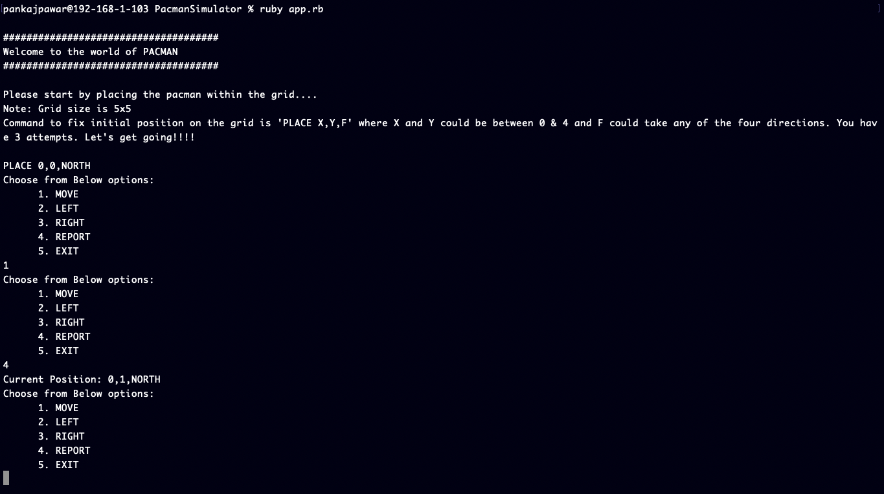

# Pacman-Simulator

## A basic Pacman simulator using Ruby

Make sure you have ruby installed on your machine.
To start the application - type 'ruby app.rb'

A sample test data is provided in testdata.md file